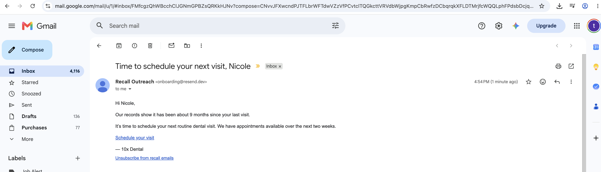

# Part D — System design and implementation

## Architecture

The deliverable is a scheduled Python CLI backed by SQLite. A server is not
required: cron invokes the same idempotent command three times daily, and every
run rebuilds current recall facts from the latest CSV exports before acting on
persisted outreach state.

```text
patients.csv + appointments.csv
              │
              ▼
     validate and derive recall state
              │
              ├── cancel sequences with a new booking
              ▼
       weekly paced enrollment
              │
              ▼
        SQLite message queue
              │
              ▼
      dry-run log or Resend API
```

SQLite stores patients, weekly pacing windows, enrollments, three scheduled
touches per enrollment, suppressions, cooldowns, and delivery attempts. The
database is the system's memory; repeat runs do not recreate an existing weekly
plan or resend a message already marked `sent`.

## State transitions

```text
eligible ──enroll──> active
                       ├── future booking detected ──> booked
                       ├── opt-out/suppression ──────> cancelled
                       └── third touch sent ─────────> completed_no_response
                                                          │
                                                   90-day cooldown
                                                          │
                                                          ▼
                                                   recontact eligible
```

Each message moves from `pending` to `sending` to `sent`. The transition into
`sending` is atomic. Every message receives a globally unique key that is saved
with it; if a process stops after claiming the message, a later run releases
the stale claim and retries with that same Resend idempotency key.

After a booking, the patient remains suppressed until that appointment becomes
a completed visit. They can enter a new recall cycle only when that later visit
itself becomes more than six months old and nothing new is booked.

## Booking timing and race limitation

Every scheduled run ingests the newest appointment export and cancels pending
touches for patients with a future non-cancelled booking. Eligibility is checked
again immediately before each email is claimed.

CSV polling cannot eliminate the small interval between the last export and the
email API call. A production integration would consume booking webhooks and
cancel pending messages immediately. The polling approach is the explicit
time-boxed limitation for this take-home dataset.

## Safety and operations

- Delivery is dry-run unless `--send` is supplied.
- A live demonstration can redirect one due message to a controlled inbox with
  `--recipient-override` and `--delivery-limit 1`.
- `pause` blocks both planning and delivery while preserving all SQLite state.
- Manual suppression persists an opt-out and cancels remaining touches.
- The supplied dataset and all local databases are ignored by Git.

## Real email demonstration

On 2026-08-20, the final verification run sent exactly one controlled email
through Resend using `--recipient-override` and `--delivery-limit 1`. It used
the latest Hot-segment copy, including the derived months since last visit.
Resend returned a provider message ID, and the engine persisted the message as
`sent`. No synthetic dataset address received email.



## Core tests

The unit suite uses temporary CSV fixtures, isolated SQLite databases, and a
fake email sender. It verifies:

- overdue, future-booked, inactive, missing-provider/status, no-history, and
  cancelled-future eligibility cases;
- exact Hot, Warm, Cold, and Very Cold calendar-month boundaries;
- month-count personalization, including clamped month-end dates;
- one enrollment plan per week;
- no repeat delivery after a successful touch;
- booking conversion and cancellation of remaining touches;
- durable opt-out suppression and blocked re-enrollment; and
- final-touch completion with a 90-day cooldown.

Run it with:

```bash
python3 -m unittest discover -s tests -v
```

Current result: **9 tests passed**.

## Time-boxed shortcuts and future work

- The CSV source is refreshed by scheduled polling; production would use source
  change events and a booking webhook.
- Practice name, booking link, and unsubscribe link are configured at runtime;
  production would validate these against trusted practice configuration.
- UI, authentication, and an always-on API are outside this CLI-focused scope.
- Delivery analytics and template experiments are described in Part C and are
  not included in the initial engine.

### Production architecture

Amazon SQS would be useful as the delivery queue, but it would not host the
application. A practical AWS deployment would be:

```text
EventBridge Scheduler (three times daily)
                    │
                    ▼
        planner/dispatcher compute
                    │
          Postgres transaction
                    │
                    ▼
             Amazon SQS queue
                    │
                    ▼
          sender workers → Resend
                    │
                    ▼
          dead-letter queue after
             exhausted retries
```

- EventBridge Scheduler would invoke the planner three times daily. The
  planner could run as Lambda while the workload remains small, or as an ECS
  Fargate scheduled task if profiling shows that processing larger exports
  needs more runtime, memory, or operational control.
- Managed Postgres would replace SQLite and remain the source of truth for
  enrollments, `due_at` times, suppressions, and idempotency keys. Input
  snapshots could be stored in S3.
- The dispatcher would atomically claim due messages and put their identifiers
  on SQS. SQS smooths bursts and lets sender concurrency be capped to protect
  both Resend and practice capacity. Day 8 and Day 21 timing stays in Postgres:
  an [SQS delay is limited to 15 minutes](https://docs.aws.amazon.com/AWSSimpleQueueService/latest/SQSDeveloperGuide/sqs-delay-queues.html),
  so SQS is not the long-term sequence scheduler.
- Each sender would recheck the patient's current state before delivery, send
  with the stored idempotency key, and persist the provider response. Failed
  jobs would retry with backoff and move to a dead-letter queue after the
  configured limit.
- Resend and database credentials would live in
  [AWS Secrets Manager](https://docs.aws.amazon.com/secretsmanager/latest/userguide/intro.html),
  not environment files committed with the application. Services would use
  least-privilege roles.

EventBridge Scheduler supports recurring Lambda invocations and can also run
[scheduled ECS tasks](https://docs.aws.amazon.com/AmazonECS/latest/developerguide/tasks-scheduled-eventbridge-scheduler.html).
This keeps the current scheduled-job design while making each component
independently scalable.

### Measurement, alerting, and capacity

Structured logs and CloudWatch metrics would cover planning, queueing,
delivery, and business outcomes. Dashboards would include:

- attempts, successful sends, failures, retries, bounces, and complaints;
- queue depth, oldest-message age, dead-letter count, and due-message backlog;
- bookings, unsubscribes, and success-to-unsubscribe ratio by segment and
  sequence touch;
- planner duration and missed runs; and
- worker CPU, memory, duration, concurrency, database latency, and connection
  use.

CloudWatch alarms would page the on-call channel for sustained delivery-failure
rates, any dead-letter accumulation, excessive queue age, missed planner runs,
or unusual increases in unsubscribes or complaints. CloudWatch alarms support
[notification actions through SNS](https://docs.aws.amazon.com/AmazonCloudWatch/latest/monitoring/cloudwatch_concepts.html).
Thresholds would be based on observed baselines rather than a single arbitrary
value.

Traffic would be evened out in three layers: distribute `due_at` times across
the day's send windows, enqueue only controlled batches, and cap sender
concurrency and provider request rate. CPU, memory, queue age, and delivery
latency would then determine whether to raise or lower those limits. This
preserves the take-home system's pacing rule while avoiding one large email
burst.
